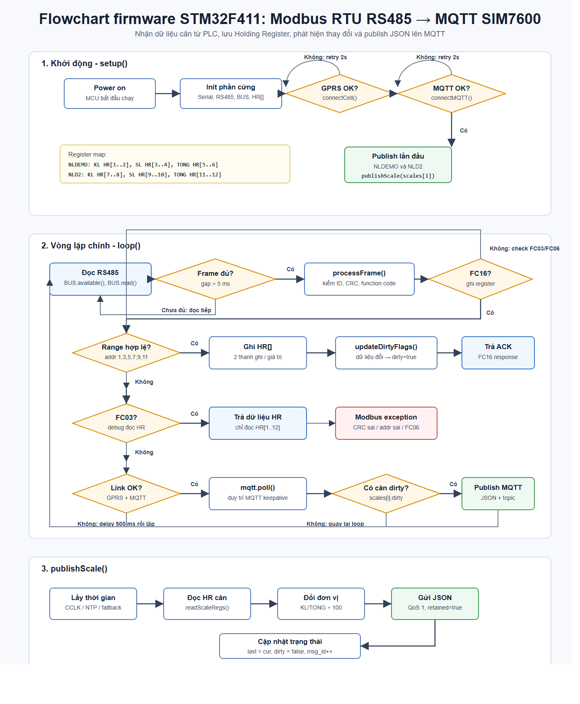

# STM32 Industrial Weight Monitoring Gateway

An embedded industrial IoT gateway that receives weighing data from a PLC through Modbus RTU over RS-485, validates each frame with CRC16, converts PLC holding registers into measurement values, and publishes JSON data to an MQTT broker through a 4G modem.

The project supports the monitoring architecture described in the research report **"Xây dựng hệ thống giám sát và quản lý cân cho nhà máy xay xát"**.

## System Architecture

```text
Electronic scales / load cells
            |
            v
           PLC
            |
   Modbus RTU over RS-485
            |
            v
 STM32F411 Industrial Gateway
   - CRC16 validation
   - Register mapping
   - 32-bit value conversion
   - JSON serialization
            |
        UART + 4G
            |
            v
      MQTT / Web / Cloud
```



## Main Features

- Implements a Modbus RTU slave on the STM32F411.
- Supports FC16 for writing multiple holding registers.
- Supports FC03 for reading the configured register range.
- Validates Modbus RTU frames using CRC16.
- Accepts only predefined register ranges to prevent invalid PLC writes.
- Combines two 16-bit registers into signed 32-bit values.
- Publishes only when weight data changes.
- Generates timestamped JSON messages with a sequential message ID.
- Uses a SIM7600/A7682-compatible 4G modem through TinyGSM.
- Automatically reconnects cellular data and MQTT links.
- Publishes retained MQTT messages with QoS 1.

## Hardware

| Component | Purpose |
|---|---|
| STM32F411CEU6 Black Pill | Main gateway controller |
| RS-485 to TTL transceiver | PLC/Modbus physical interface |
| SIM7600 or A7682-series modem | 4G data connection |
| Mitsubishi or compatible PLC | Collects and sends weighing data |
| Industrial power supply | Powers the controller and communication modules |

### Pin Mapping

| Function | STM32 pin |
|---|---|
| RS-485 UART TX | PA2 |
| RS-485 UART RX | PA3 |
| RS-485 direction control | PB10 |
| 4G modem UART TX | PB6 |
| 4G modem UART RX | PB7 |

## Current Register Map

The firmware currently contains two configured scale slots. Each measurement uses two holding registers.

| Scale | Measurement | Holding registers |
|---|---|---|
| NLDEMO | Current weight | HR[1..2] |
| NLDEMO | Count | HR[3..4] |
| NLDEMO | Total weight | HR[5..6] |
| NLD2 | Current weight | HR[7..8] |
| NLD2 | Count | HR[9..10] |
| NLD2 | Total weight | HR[11..12] |

The research architecture is designed to be extended to additional weighing points by adding scale definitions and register ranges.

## MQTT Message Example

```json
{
  "weight_code": "NLDEMO",
  "timestamp": "2026-05-11T10:30:00Z",
  "msg_id": 1,
  "PLC1_KL_CAN_1": 123.45,
  "PLC1_SOLUONG_1": 10,
  "PLC1_TONG_KL_1": 1234.50,
  "value": 123.45
}
```

## Repository Structure

```text
.
├── docs/
│   ├── modbus_mqtt_flowchart.png
│   ├── modbus_mqtt_flowchart.svg
│   └── project-report.pdf
├── include/
│   └── secrets.example.h
├── src/
│   └── main.cpp
├── .gitignore
├── platformio.ini
└── README.md
```

## Getting Started

### 1. Install the development tools

- Visual Studio Code
- PlatformIO extension
- ST-Link driver and programmer

### 2. Configure credentials

Copy the example configuration:

```text
include/secrets.example.h -> include/secrets.h
```

Edit `include/secrets.h` and enter the cellular APN and MQTT broker settings. The real file is excluded through `.gitignore`.

### 3. Check hardware configuration

- Confirm the RS-485 A/B wiring and common ground.
- Match the PLC and gateway baud rate, parity, stop bits, slave ID, and register map.
- Provide a stable power supply for the 4G modem.
- Confirm the modem UART voltage levels before connecting it to the STM32.

### 4. Build and upload

Open the project in PlatformIO, select `genericSTM32F411CE`, then build and upload with ST-Link.

## Validation and Limitations

The supplied research report records **307 valid Modbus frames out of 307 received frames (100%)** during controlled experimental tests. This result describes the reported test setup only; the system has not yet been validated through long-term deployment in a production rice mill.

Further testing should cover cellular outages, RS-485 noise, power loss, broker unavailability, larger device counts, credential rotation, and local buffering when the cloud connection is unavailable.

## Demo and Documentation

- [Demonstration video](https://youtu.be/YBucla-Mdf4)
- [Full project report (PDF)](docs/project-report.pdf)

## Security Notes

- Real APN and MQTT credentials are not stored in the public repository.
- Do not commit `include/secrets.h`.
- Use a dedicated MQTT account with the minimum required permissions.
- Use TLS and certificate validation when supported by the modem and broker.
- Rotate any credential that has previously appeared in source code or logs.
